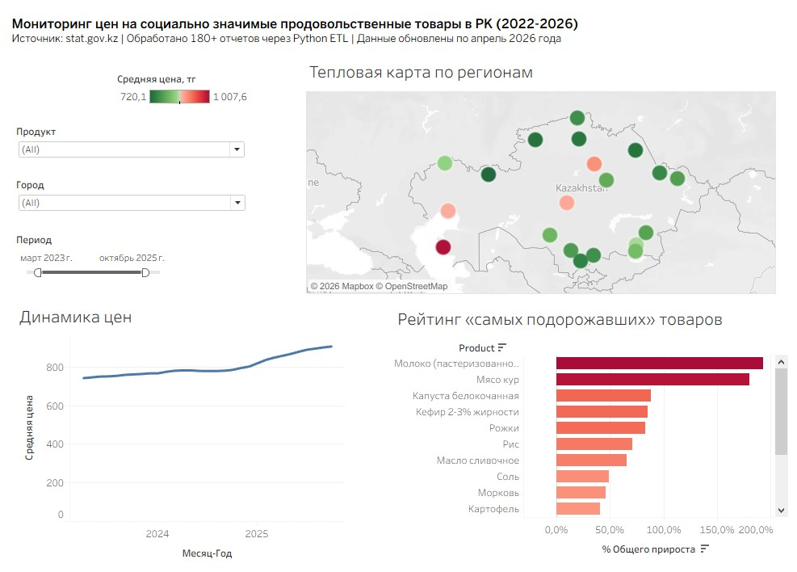

# Мониторинг цен на социально значимые товары (СЗПТ) в Казахстане (2022–2026)

## 📌 Описание проекта
Проект посвящен автоматизации сбора и визуализации данных о ценах на социально значимые продовольственные товары в Республике Казахстан. В основе лежат еженедельные отчеты Бюро национальной статистики РК, преобразованные из разрозненных Excel-таблиц в интерактивный аналитический дашборд.

**Ключевой результат:** Создан сквозной процесс (End-to-End) от обработки "сырых" данных до получения бизнес-инсайтов о темпах инфляции.

---

## 🛠 Технологический стек
*   **Язык:** Python (библиотеки: `pandas`, `glob`, `re`, `os`).
*   **BI Инструмент:** Tableau Public.
*   **Источник данных:** [stat.gov.kz](https://stat.gov.kz) (180+ еженедельных отчетов).

---

## 🚀 Этапы реализации

### 1. ETL-процесс (Python)
Главная сложность заключалась в нестабильной структуре исходных `.xls` файлов. Написанный скрипт решает следующие задачи:
*    **Автоматизированный сбор данных (Extract)**: Скрипт сканирует сайт Бюро национальной статистики РК, находит ссылки на еженедельные отчеты с помощью регулярных выражений и скачивает их, присваивая имена в формате даты (ГГГГ-ММ-ДД.xls)
*   **Автоматический поиск данных:** Скрипт сканирует папку, находит целевые листы (включая листы с именами "5") и определяет начало таблицы по ключевым словам (городам).
*   **Нормализация названий (Mapping):** Исправлены дубликаты и вариации названий товаров (например, "Рожки весовые" и "Рожки" объединены в одну категорию).
*   **Очистка от агрегатов:** Исключены строки «По обследованным городам» и «Средние цены», искажающие региональную аналитику.
*   **Трансформация:** Данные переведены в формат "Long Data" (Melt), оптимальный для BI-систем.

### 2. Визуализация и аналитика (Tableau)
Разработан интерактивный дашборд, включающий три ключевых разреза:
*   **Географический:** Тепловая карта Казахстана по уровням цен.
*   **Временной:** Линейный график динамики, подсвечивающий резкие скачки цен (особенно в начале 2026 года).
*   **Сравнительный:** Рейтинг самых подорожавших товаров.

> **Методология рейтинга:** Для корректного сравнения при наличии пропусков в данных использовались **LOD-выражения (FIXED)**. Расчет прироста идет от первой доступной цены конкретного товара к последней доступной.

---

## 📈 Ключевые выводы
*   **Наибольший рост:** Продукты категории "Мясо кур" и "Рис" показали прирост свыше 70% за исследуемый период.
*   **Аномалии:** В начале 2026 года зафиксирован резкий подъем цен на молочную продукцию (сметана, творог).
*   **Регионы:** Выявлена значительная разница в ценах между западными регионами и югом страны.

---

## 🖥 Вид дашборда

## 🔗 Ссылки
*   **Интерактивный дашборд:** [Смотреть на Tableau Public](https://public.tableau.com/app/profile/tolendi.kaken/viz/KazakhstanFoodPriceMonitoring2022-2026/sheet0)

---
